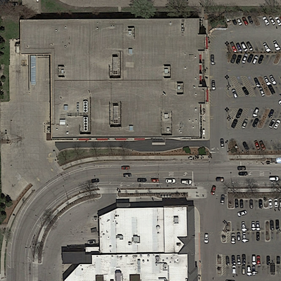
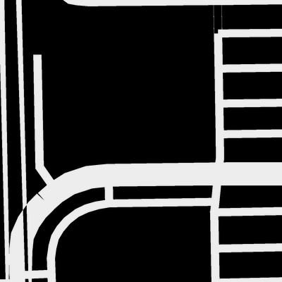

# CS-433 Project 2: Road Segmentation Using U-net

This is a repository for the second project of the Machine Learning (CS-433) course at EPFL by Nicolas Flammarison and Martin Jaggi, autumn 2021. The objective of this project is to train a classification model to segment the roads in aerial images. The train dataset consists of 100 pairs of 400x400 pixels aerial images from Google Maps and their ground-truth images, in which the road pixels are labeled 1 and background pixels with 0. One of the train images and its ground-truth is presented below:

 

## Setup
This setup requires a Default Unix Environment with an installed Pyhton 3.7 or Python 3.8. Use the following command to install all the required libraries:
```bash
pip install -r requirements.txt
```

## Codes and folders
The train and test data are in `./dataset`. All new experiments will be saved in the `./experiment` folder under the given name to the experiment. `model.py` contains the U-Net model classes along with two similar models. `dataset.py` contains the dataset classes and transformations (data augmentation) for train, validation, and test data. `utils.py` contains all auxiliary functions. For training and testing, `main.py` should be called, which is described in the next section.

## Training and testing

For training a new model or getting the predictions of a model on the test dataset, call `main.py`. The following table shows the arguments that control the process.

| Flag                  | Type  | Default   | Description                               | 
| --------------------- | ----- | --------- | ----------------------------------------- |
| path                  | str   | './dataset' | Dataset path.                           |
| experiment_name       | str   | NotSpec   | The name of the experiment.               |
| train                 | bool  | True      | Trains the model if True.                 |
| test                  | bool  | True      | Tests the model if True.                  |
| model                 | str   | 'UNet'    | The selected model among: 'UNet', 'UNet06', 'WNet0404'.|
| validation_ratio      | float | None      | The ratio of the validation dataset.      |
| rotate                | bool  | True      | Train over rotated images.                |
| flip                  | bool  | True      | Random flip in training.                  |
| resize                | int   | None      | The resize value for test images.         |
| random_crops          | int   | 0         | Number of random erasings per image.      |
| epochs                | int   | 100       | Number of epochs.                         |
| batch_size            | int   | 8         | The batch size for SGD.                   |
| lr                    | float | 1e-03     | The initial optimization learning rate.   |
| loss                  | str   | 'dice'    | Loss function among: 'dice', 'cross entropy', 'dice + cross entropy'|
| adversarial_bound     | float | 0         | The bound (epsilon) of the adversarial training. No adversarial attack if zero.|
| cuda                  | int   | 1         | Uses GPU if 1, CPU if 0.                  |
| save_weights          | bool  | False     | Saves the weights after every 10 epoch if True.|
| weight_path           | str   | None      | Path of the initial weights (If needed).  |

- The results will be saved in a folder with the given experiment name in `./experiments`.
- If you are using an external dataset, or are storing the dataset in a different directory, the directory should be given by `--path /.../dataset`.
- If you don't have access to a GPU, set `--cuda 0`.

### Examples

To train a new model based on `0.8` training dataset, validating on `0.2` of the dataset, and then testing it on the testing dataset, without adding the rotations, with `10` random crops per training image, and for `100` epochs, run:
```bash
python main.py --path ./dataset --experiment "Train_And_Test" --validation_ratio 0.2 --rotate False --random_crops 10 --epoch 100
```
- Set `--save_weights True` to save the weights after every epoch.
- To start from initial weights, set `--weights_path /.../weights.pt`.
- Set `--test False` to not perform the test.


To get the test results based on a pre-trained model, run:
```bash
python main.py --path ./dataset --weights_path "/.../weights.pt" --experiment "Test_Pretrained" --train False
```

### Regenerating the final submission

The results of the final AICrowd submission ([#168633](https://www.aicrowd.com/challenges/epfl-ml-road-segmentation/submissions/168633)) is in `./experiments/Final_Submission`. The pre-trained weightes could not be included due to github limitations. To train and predict using this model, please download the floder from [Google drive](https://drive.google.com/drive/folders/1_ZoEnNRjN6OTn2d6arfJIbMQX4kv6Zwv?usp=sharing) and replace the folder on your local machine. To train and regenerate the same model and result, run the following command:
```bash
python main.py --experiment "Final_Submission_Gen" --path ./dataset --model "UNet" --validation_ratio 0.2 --cuda 1 --loss 'dice' --epoch 70 --save_weights True
```
- The predictions and the submission file will be saved in this directory: `./experiments/Final_Submission_Gen`.
- If you don't have access to a GPU, set `--cuda 0`.


To get predictions of the trained model on the test dataset, run:
```bash
python main.py --path ./dataset --weights_path "./experiments/Final_Submission/Final_Submission.pt" --experiment "Final_Submission_Test" --train False
```
- Please make sure to replace the `Final_Submission` folder with the link provided above before running this command.
- The predictions and the submission file will be saved in this directory: `./experiments/Final_Submission_Test`.
- If you don't have access to a GPU, set `--cuda 0`.


## Contributors
- Ali Garjani ([ali.garjani@epfl.ch](mailto:ali.garjani@epfl.ch))
- Sepehr Mousavi ([sepehr.mousavi@epfl.ch](mailto:sepehr.mousavi@epfl.ch))
- Bruno Ploumhans ([bruno.ploumhans@epfl.ch](mailto:bruno.ploumhans@epfl.ch))
